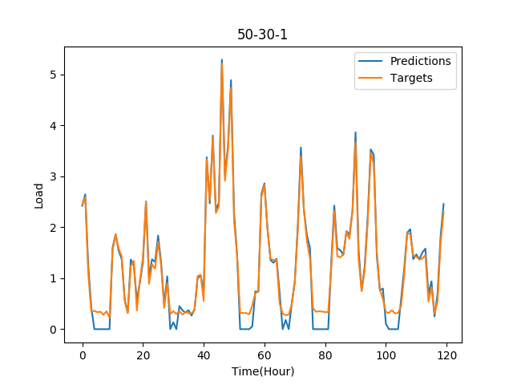

# Report for Artificial Neural Networks based model

## At Minute Resolution

|Layers      |Depth  |Val RMSE  |Test RMSE  |Epochs          |
|------------|:-----:|:--------:|:---------:|:--------------:|
|10          |1      |0.225880  |0.210364   |8               |
|20          |1      |0.226079  |0.216577   |4               |
|30          |1      |0.224592  |0.208589   |10              |
|50          |1      |0.224660  |0.212160   |10              |
|100         |1      |0.225014  |0.209208   |9               |
|30-20-1     |2      |0.223781  |0.213283   |9               |
|50-10-1     |2      |0.222429  |0.210746   |9               |
|50-20-1     |2      |0.222732  |0.212942   |7               |
|50-30-1     |2      |0.223104  |0.207691   |8               |
|40-30-20-1  |3      |0.223611  |0.217030   |9               |

## At Hour Resolution

|Layers      |Depth  |Val RMSE  |Test RMSE  |Epochs          |
|------------|:-----:|:--------:|:---------:|:--------------:|
|10          |1      |0.194820  |0.189045   |10              |
|20          |1      |0.211804  |0.202007   |10              |
|30          |1      |0.218770  |0.219522   |10              |
|50          |1      |0.189401  |0.192782   |10              |
|100         |1      |0.174945  |0.164293   |10              |
|30-20-1     |2      |0.136368  |0.145676   |10              |
|50-10-1     |2      |0.166194  |0.187626   |10              |
|50-20-1     |2      |0.148883  |0.151476   |9               |
|50-30-1     |2      |0.156741  |0.168448   |9               |
|40-30-20-1  |3      |0.162048  |0.186498   |9               |

