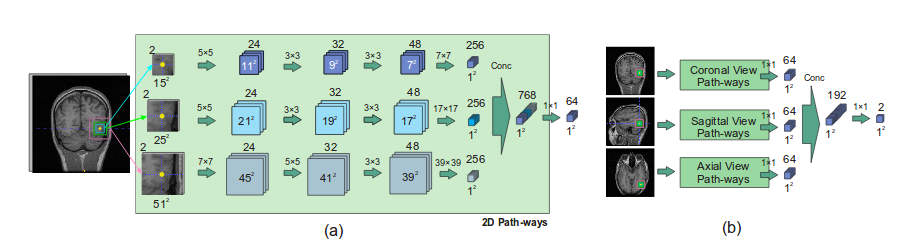

# A Comparative Study: The Novel Brain Extraction Techniques using Auto Context Convolutional Neural Networks vs the Previous Threshold/Watershed Segmentation Algorithms in Functionl Brain Scans

## Motivation 

The brain extraction remains a hot topic in research for finding out the valid voxels in a magnetic resonance imaging scan. The conventional toolkits for preprocessing of functional scan of a subject(MRI image) use FSL's Brain Extraction Tool (BET), BrainSuite’s Brain Surface Extractor (BSE), AFNI’s 3dIntracranial for brain extraction. Since the brain extraction remains an integral and the first step in preprocessing, the whole analysis and the various hypothesis testings on the brain depend on the identification of the right portion of brain in a subject. Thus, segmenting it out from the skull and the neck portion of body is essential for research purposes. 

Moreover, since I work in the Neuroimaging lab at SIT, the making of such a tool will reduce a great burden of using the FSL's BET and verifying whether it has performed good or not.

## Problem Statement & Solution

We are given a set of functional MRI scans and also the sets of coarse
brain portions. (Run length identification (RLI) scheme is used for region
labeling and searching. Then a set of segmentation processes such
as morphological operations and connected component analysis
(CCA) are done to produce a fine brain.) In overall, the methods used are unsupervised. 

The dice coefficient, False Positive Rate and False Negative Rates are used as the measures for comparing the models.

* [Paper on brain extraction using region labeling and morphological operations](http://www.sciencedirect.com/science/article/pii/S0010482511001284)

* [Paper on Auto-Context based CNN for Brain Extraction](http://ieeexplore.ieee.org/document/7961201/#full-text-section)

In this paper, they talk about the Auto-Context CNN. The proposed network has nine types of input features and nine corresponding pathways which are merged in two
levels. Each pathway contains three convolutional layers. This
architecture segments a 3D image voxel-by-voxel. For all
voxels in the 3D image three sets of in-plane patches in axial,
coronal, and sagittal planes are used. Each set contains three
patches with window sizes of 15×15, 25×25 and 51×51. By using these sets of patches with different window size, both local and global features of each voxel are considered during training. Network parameters are learned simultaneously based
on orthogonal-plane inputs, so 3D features are learned without
using 3D convolution which is computationally expensive.

