# Minute Resolution

## Results

|Layers  |Units  |Validation RMSE  |Test RMSE   |Checkpoint |
|--------|:-----:|:---------------:|:----------:|:---------:|
|1       |5      |0.228            |0.222       |7600       |
|2       |5      |0.227            |0.203       |8100       |
|3       |5      |0.228            |0.199       |9200       |
|4       |5      |0.228            |0.204       |12200      |
|1       |20     |0.228            |0.203       |3200       |
|2       |20     |0.227            |0.202       |2800       |
|3       |20     |0.227            |0.202       |2800       |
|1       |50     |0.227            |0.201       |2700       |
|2       |50     |0.223            |0.195       |7100       |
|1       |100    |0.228            |0.201       |3200       |

## Going Deeper

While the RMS (Root Mean Square) error decreases, the fit on the unseen data (test set) doesn't improve that much.

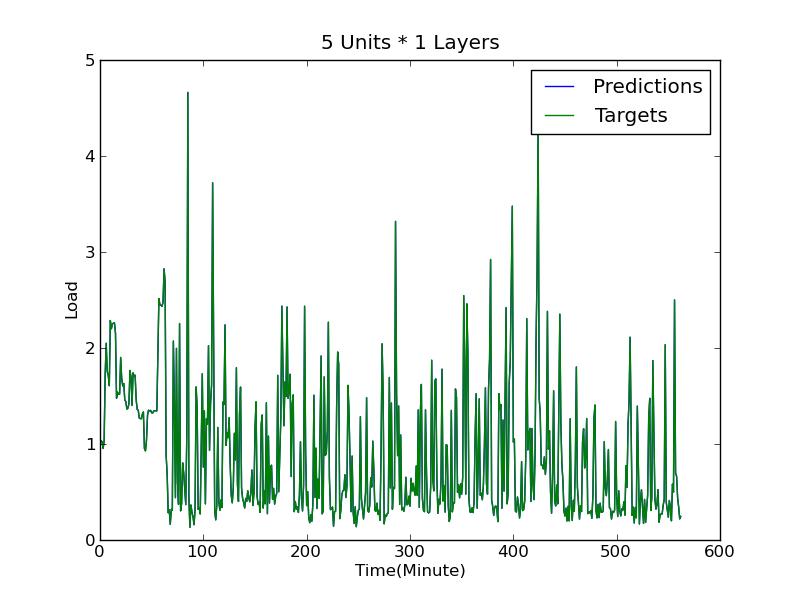 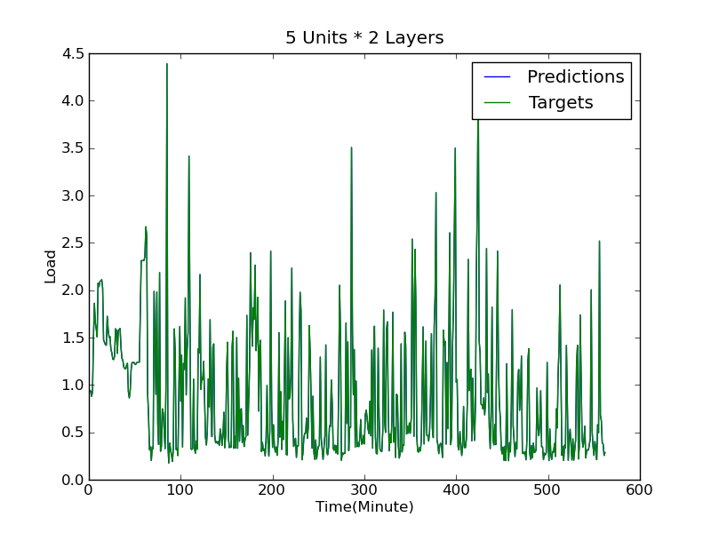

 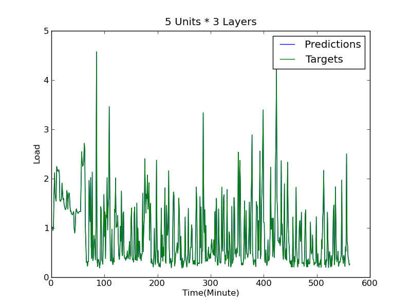

## Going Wider

Going wider neither improves the RMSE nor the fit suggesting that predicting at the minute level is relatively simple enough

 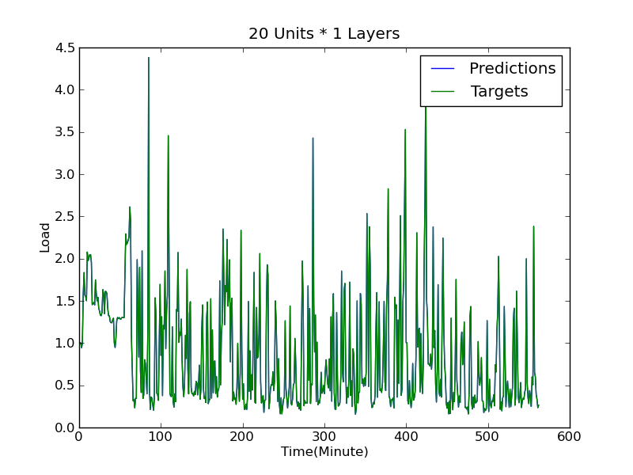

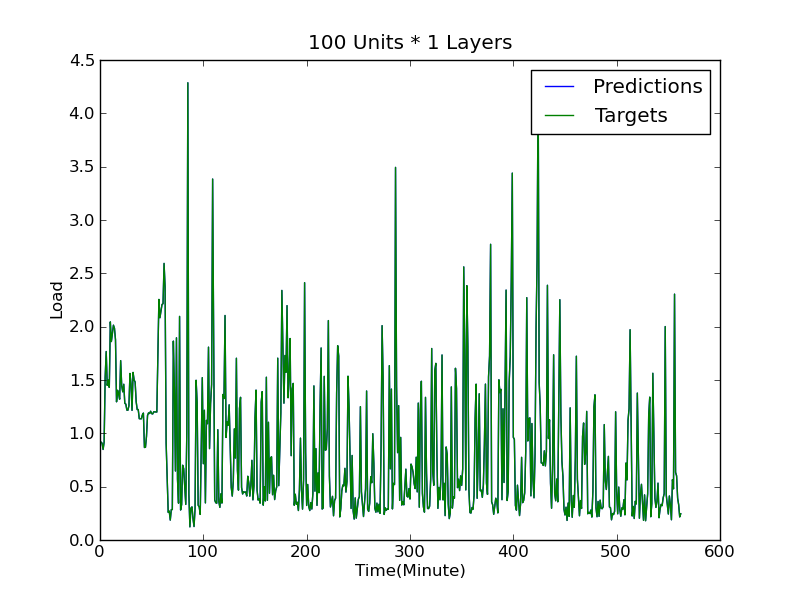 

# Hour Resolution

|Layers  |Units  |Validation RMSE  |Test RMSE   |Checkpoint |
|--------|:-----:|:---------------:|:----------:|:---------:|
|1       |5      |0.449            |0.437       |4300       |
|2       |5      |0.442            |0.431       |5000       |
|3       |5      |0.443            |0.433       |5000       |
|4       |5      |0.439            |0.424       |5000       |
|1       |20     |0.420            |0.408       |5000       |
|2       |20     |0.413            |0.397       |4700       |
|3       |20     |0.414            |0.395       |4600       |
|1       |50     |0.417            |0.398       |4700       |
|2       |50     |0.413            |0.393       |4100       |
|1       |100    |0.414            |0.397       |4600       |

## Going Deeper

While the RMS (Root Mean Square) error decreases, the fit on the unseen data (test set) doesn't improve that much.

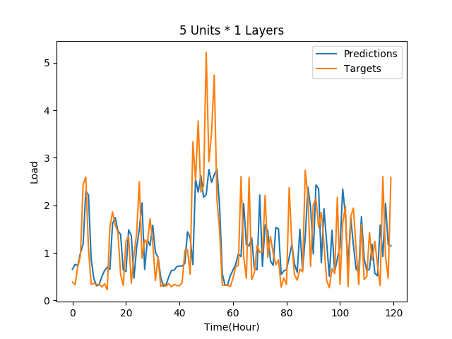 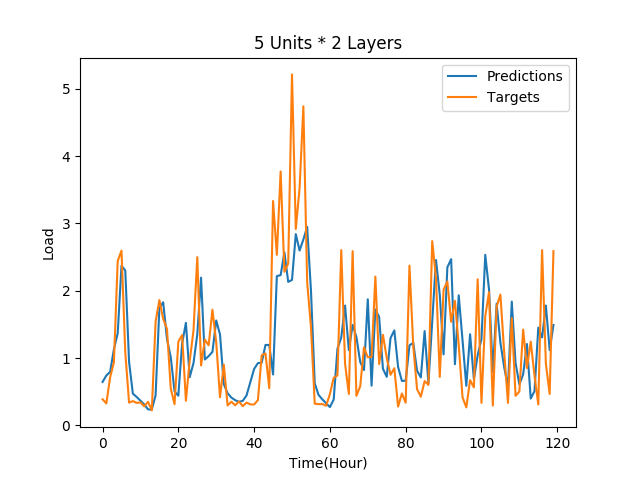

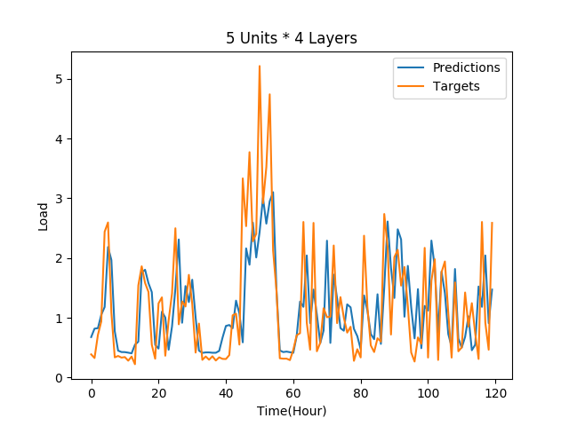 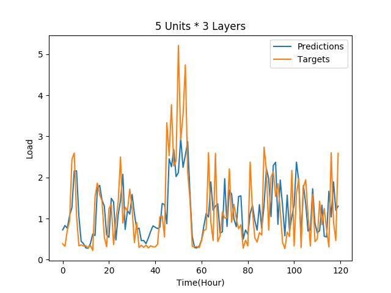

## Going Wider

Going wider neither improves the RMSE nor the fit suggesting that predicting at the minute level is relatively simple enough

 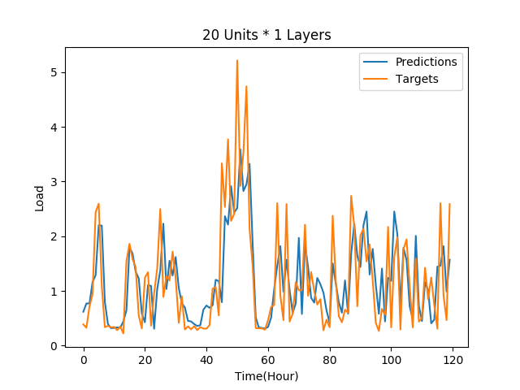

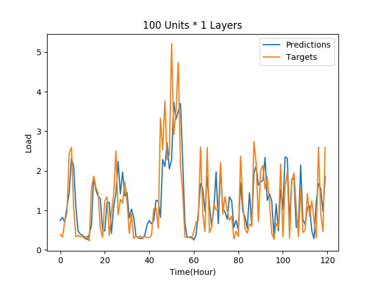 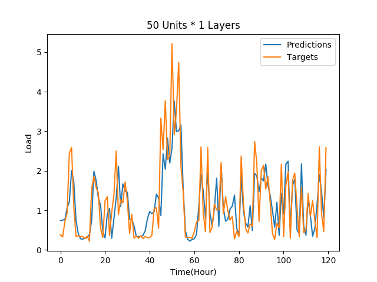

